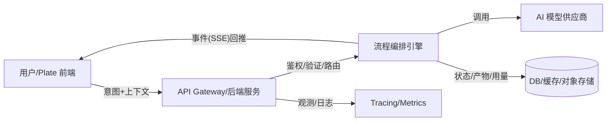

# AI 模块设计与后端规划（v1）

> 目标：将前端（Plate.js）收缩为“意图采集 + 内容渲染”的瘦层，把 Prompt 工程、模型编排、鉴权/计费/观测统一收口在后端，支持长流程、可恢复、可观测、可演进。

---

## 1. 背景与范围

* **背景**：现状前端承担了 onGenerate 等 Prompt 构造与模型直连，存在密钥暴露、逻辑分散、撤销与并发易出毛刺等问题。
* **目标**：重划前后端边界，建立面向意图的 API 与结构化事件流（SSE），打造可版本化的流程编排内核。
* **范围**：本文覆盖架构原则、数据契约、API 设计、事件协议、流程引擎、可靠性/观测/成本、安全合规、里程碑与验收清单。
* **不在范围**：多人实时协作（yjs 等）、富权限文档仓库、移动端离线同步。

---

## 2. 设计原则

1. **前端瘦、后端厚**：前端只说“做什么 + 这里是上下文快照”，后端决定“怎么做”。
2. **事件优先，面向流**：统一采用 SSE 推送 `token/patch/step/artifact/usage/final/error` 等事件；前端按事件渲染。
3. **显式版本化**：`flow@version`、Prompt 模板、工具集合都可版本化并做灰度/A-B。
4. **可恢复与幂等**：`runId` 一致即可幂等恢复；失败可 `resume_from` 上一次失败步骤。
5. **可观测**：全链路 tracing + 指标 + 结构化日志，产物与错误可溯源。
6. **安全先行**：密钥仅在服务端；请求校验、速率限制、日志脱敏默认开启。

---

## 3. 架构总览



---

## 4. 数据契约（前端 → 后端）

**v1 精简与加固（采纳评审意见，并新增上下文控制）**

* **移除 `client.editorHash`**：v1 不再从前端提交文档哈希；若需缓存，由后端基于 `intent + context.text + flow@version` 计算 `context_hash`（BLAKE3/xxHash64，流式）。
* **引入 `doc.version`（乐观一致性）**：前端维护文档的**递增版本号**或时间戳，每次编辑递增；AI 请求携带 `doc.version`，后端在事件中回显 `docVersion`。前端在应用 `token/patch` 前，若本地版本 ≠ `docVersion`，则**拒绝应用**并提示用户（v1 策略：放弃并提示）。
* **弱化 Slate 选择路径**：v1 不依赖 `[p,i]` 路径在后端解析。由前端提供**上下文快照**与**选择哨兵**，后端无需理解 Slate 结构即可稳健定位。
* **规范化上下文格式**：`context.text` 统一为 **Markdown**（Plain 可选但不优先）。
* **上下文大小控制（前端+后端双闸）**：

  * 前端：**软上限 4k 字符**、**硬上限 16k 字符**；超软上限提示用户，超硬上限**截断**并在请求体 `options.truncated=true` 标记；
  * 后端：再次校验，拒绝超限或自动压缩（按 flow 策略）。
* **模型与长度偏好（可选提示，后端为真相源）**：

  * `options.preferredModel`: 客户端偏好模型标识（如 `gpt-4.1-mini`/`deepseek-chat`）。
  * `options.maxInputTokensHint`: 客户端对**可用输入上限**的估计；用于**提示**而非强约束。
  * 实际路由与限额由后端基于服务器端配置 `max_model_tokens`, `reserved_output_tokens` 等决定。

**请求体（v1 示例）**：

```json
{
  "intent": "summarize",
  "flow": "sum:v2",
  "client": { "runId": "uuid", "app": "OpenAiWriter@web" },
  "doc": {
    "id": "doc_42",
    "version": 128,
    "selectionRef": {
      "mode": "selection|block|around_cursor",
      "blockIds": ["b1","b2"],
      "snapshot": "…上文…[START_SELECTION]这是选中文本[END_SELECTION]…下文…",
      "snapshotHash": "blake3-…"
    },
    "context": {
      "text": "……序列化的 Markdown……",
      "chars": 2048
    }
  },
  "options": { 
    "temperature": 0.2,
    "maxTokens": 800,
    "locale": "zh-CN",
    "truncated": false,
    "preferredModel": "auto",
    "maxInputTokensHint": 12000
  },
  "schema": { "type": "string" }
}
```

说明：

* `selectionRef.snapshot` 使用 `[START_SELECTION]/[END_SELECTION]` 明确边界；后端即使不懂 Slate，也能进行模糊/稳健匹配。
* `selectionRef.blockIds` 作为**软锚点**辅助匹配；不强依赖。长期方向：引入基于内容的锚点/差异定位（如 diff‑match‑patch）。
* 未来若接入后端文档仓库，可将 `context` 从**文本**切换为**引用**（rangeId/chunkId），由后端自行取数。

---

## 5. 事件协议（后端 → 前端，SSE）

**v1 渲染模式协商（已采纳） + 结构化 patch 扩展 + 多任务事件**

* 在首个步骤开始时明确渲染模式：

```json
{ "type": "step", "phase": "start", "name": "draft", "renderMode": "streaming-text", "docVersion": 128 }
// 或
{ "type": "step", "phase": "start", "name": "draft", "renderMode": "atomic-patch", "docVersion": 128 }
```

* **互斥规则**：

  * `streaming-text`：只发送 `token`（以及 `step/artifact/usage/final/error`），**不发送** `patch`；模式一经宣布不得切换。
  * `atomic-patch`：整段生成在后端缓冲，最终只发送 **一次** `patch`；**不发送** `token`。
* **patch 目标与粒度**：

  * 目标以请求体回显的 `selectionRef` 为锚点，**不可依赖“当前选区”**；
  * **操作类型**（v1 约束 + 预留 v2）：

```json
// v1：单块文本替换
{ "type":"patch", "op":"replace_text", "target":{"type":"selectionRef", "ref":{ "docId":"doc_42","snapshotHash":"…","blockIds":["b1"] }}, "text":"替换后的内容" }

// v2 预留：结构化节点替换（跨块）
{ "type":"patch", "op":"replace_nodes", "target":{"type":"selectionRef", "ref":{ "docId":"doc_42","snapshotHash":"…","blockIds":["b1","b2"] }}, "nodes":[ {"type":"paragraph","children":[{"text":"第一段"}]}, {"type":"bulleted-list","children":[…]} ] }
```

* **多任务/分块事件（用于长上下文编排）**：

```json
{ "type":"plan",   "chunks": [{"id":"c1","range":"b1..b3","tokens":3900}, {"id":"c2","range":"b4..b7","tokens":4100}], "strategy":"map-reduce", "model":"auto" }
{ "type":"map:start",   "chunkId":"c1" }
{ "type":"map:token",   "chunkId":"c1", "text":"…" }
{ "type":"map:end",     "chunkId":"c1", "summary":"…" }
{ "type":"reduce:start" }
{ "type":"reduce:token", "text":"…整合中…" }
{ "type":"reduce:end",   "text":"…最终稿…" }
```

* **取消双向确认**：前端 `abort()` 后，后端在收到取消信号并关闭上游后，**必须发送** `{ "type":"final", "status":"cancelled" }`。前端在 UI 层面应在 `abort()` 的同时停止渲染该 `runId` 的任何后续事件（滞后“幽灵”帧直接丢弃）。

**预算与取消细化**：见 §11。

---

## 6. 前端（Plate）实现要点

1. **意图采集**：`intent` 固定枚举，附 `options`；携带 `doc.version`。
2. **上下文快照**：`context.text` 统一 Markdown；`selectionRef.snapshot` 带 `[START_SELECTION]/[END_SELECTION]`；前端实施 **软/硬上限**（4k/16k）与提示/截断。
3. **渲染管线**：

   * 开始：`startAIUndoBatch()` + `Editor.addMark(editor,'ai',true)`；渲染模式来自首帧 `renderMode`；`atomic-patch` 模式**不直接插入**，等待最终 patch。
   * 过程中：`streaming-text` → `Transforms.insertText`；`atomic-patch` → 一次 `patch` 替换 `selectionRef` 区域；应用前校验 `docVersion` 一致。
   * 结束：`final/error/cancelled` → `endAIUndoBatch()` + 去标记 + 状态复位。
4. **并发与防抖**：以 `runId` 守卫；新请求先 `abort()` 旧请求；丢弃与当前 `runId` 不匹配的帧。
5. **只读锁（建议）**：生成期间将编辑器临时置 **只读**（或阻断 `beforeinput`），避免用户输入污染撤销批次。若允许编辑，需将用户输入独立成**并行撤销事务**，复杂度高，v1 不推荐。
6. **可见性节流与缓冲**：页面不可见时，将 `token` 事件暂存于缓冲队列；恢复可见后**合并插入**（一次 `Transforms.insertText`）以提升流畅度。
7. **错误与边界**：断网/超时/取消均走统一收尾；`TextDecoder('utf-8',{fatal:false})` 处理跨帧多字节字符。

---

## 7. 后端接口设计

> 不建议“万能口”；以**能力域**拆分端点，并在请求中明确 `flow@version`。

**示例**：

* `POST /api/ai/ask` — 自由提问/问答
* `POST /api/ai/summarize` — 摘要（选区/段落/全文）
* `POST /api/ai/rewrite` — 改写（语气、长度、风格）
* `POST /api/ai/continue-writing` — 续写（基于光标前上下文）
* `POST /api/ai/fix-grammar` — 语法拼写修正

**通用响应**：SSE 事件流（见 §5）。

**头部与鉴权**：

* 仅接受来自受信前端域（CORS 限制）。
* 会话级 token（如 JWT）或项目内用户标识；每次请求落库 `runId` → `flow_runs`。

---

## 8. 流程编排引擎（后端核心）

**抽象**：

* `Flow`：命名有向步骤集合，带 `version` 与默认重试/超时策略。
* `Step`：`type: llm|tool|branch|map`；实现 `run(input, ctx)`；

  * **元数据**：`deterministic: boolean`、`retryable: boolean`、`resumable: boolean`。
* `Ctx`：`runId`、取消信号、事件 `emit()`、KV 状态、记录器、预算计数器、**featureFlags**（动态开关缓存、降级、详细日志等）、**limits**（`max_model_tokens`, `reserved_output_tokens`, `max_input_tokens`）。

**控制**：

* **重试与超时**：每步 `maxRetries + 指数退避`，`timeoutMs` 受控；
* **输入输出留痕**：`flow_steps.input/output` 必填；加 `input_hash` 便于复验；
* **恢复策略**：

  * 若 `deterministic=true && resumable=true`：`resume_from` 跳过已成功步骤继续；
  * 若 `deterministic=false`：恢复时**重新执行**该步（避免污染后续）；
  * 若 `retryable=false`：失败直接上浮为流程失败或走人工介入/降级链。
* **降级链**：主模型失败 → 备份模型；结构化失败 → 退化文本。
* **预算**：流程级 token/成本上限，详见 §11。
* **取消**：接入前端取消信号；在调用上游模型前/流读取 loop 内**多处检查**；完成后推送 `final: cancelled`。
* **长上下文编排（LCG）**：

  * **Preflight**：按模板开销 + 工具开销 + `limits` 计算可用输入上限；
  * **分块（Chunker）**：优先按 Markdown/块级语义切分；窗口对齐（重叠率 r）；保留**块ID/哈希**；
  * **Map‑Reduce**：对每块并行 `map`（rewrite/summarize/fix 规则保持结构），再 `reduce` 汇总/拼接；
  * **合并策略**：

    * rewrite/fix：块级原地替换；
    * summarize：reduce 产物为全局摘要；
    * continue：滑动窗口 + 末尾块增量生成；
  * **事件**：`plan` / `map:*` / `reduce:*`（见 §5）。

**提示模板/工具调用**：

* Prompt 模板版本化（`tmpl@v1`），few-shot 灰度；
* 工具调用失败可回退链上下一步。

---

## 9. 数据与存储

**分层存储策略（高并发友好）**：

* **高频/轻记录**（DB）：「`flow_runs`、`usage`」——主打实时写入，字段精简。
* **步骤留痕**（DB + 对象存储）：

  * `flow_steps` 仅存元数据与小型 `input_hash/output_hash`；
  * 大体量 `input/output/artifacts/events` 默认**不入库**，在 Debug/失败/指定 flow 版本时，写入 **对象存储（S3/MinIO）**，DB 只保留指针与大小摘要。
* **产物**（对象存储）：`run_artifacts` 放对象存储，DB 存索引与元信息。

**表结构（更新）**：

* `flow_runs`：`run_id`(PK)、`intent`、`flow`、`status`、`created_at/ended_at`、`user_id`、`doc_id`、`options`、`error`、`context_hash`。
* `flow_steps`：`id`、`run_id`(FK)、`name`、`type`、`status`、`deterministic`、`retryable`、`resumable`、`input_hash`、`output_hash`、`error`、`started_at/ended_at`、`retries`、`payload_ref`（对象存储指针）。
* `run_artifacts`：`id`、`run_id`、`step`、`kind`、`object_ref`、`size`。
* `usage`：`id`、`run_id`、`model`、`input_tokens`、`output_tokens`、`cost`、`currency`。
* `events`（可选）：对象存储；DB 存 `events_ref` 与摘要。
* `selection_refs`（可选）：`run_id`、`doc_id`、`snapshot_hash`、`block_ids`、`snapshot`。

**存储选型**：开发 SQLite/Turso；生产 Postgres + S3 兼容对象存储。

---

## 10. 安全与合规

* **密钥**：只在后端；KMS/Secrets 管理；按供应商/环境隔离。
* **输入校验**：限制 `context.text` 长度与敏感字符；意图白名单。
* **速率限制**：按用户/IP/项目三层；突发 + 平滑窗。
* **日志脱敏**：默认屏蔽邮箱/手机号/身份证/访问令牌；
* **CORS/CSRF**：仅允许受信 Origin；
* **隐私**：允许用户选择“禁用数据留存”。

---

## 11. 成本与性能

* **模型选路**：按场景选择价效比模型；可按 `flow` 覆盖；支持**长上下文模型优先**（如可用则直通）。
* **上下文限流与治理（通用/智能）**：

  * **limits 配置**：`max_model_tokens`, `reserved_output_tokens`, `max_input_tokens`（后端为真相源，可随模型动态切换）；
  * **Preflight**：估算 prompt + 工具 + 安全垫，决定**直通 / 分块 / 摘要压缩**；
  * **分块策略**：按 Markdown/块级切分，保持结构与语义边界；重叠窗口（r=5–10%）减轻边界割裂；
  * **多任务并行**：`map` 并行度受 `QPS/预算/限流` 控制；`reduce` 统一合并；
  * **增量与复用**：以块哈希做**增量缓存**；未变块直接复用上次 `map` 结果；
  * **优雅降级**：长上下文模型不可用时，自动启用 LCG 分块编排；
  * **可观测**：`plan/chunk` 指标（块数、平均 tokens、复用率、并行度）。
* **Prompt 压缩**：片段去重、引用化；超长文断点摘要。
* **缓存**：

  * key = `hash(intent + flow + context.text + tmpl)`；
  * 大文本使用 **BLAKE3/xxHash64** 的**流式**计算；必要时对超大文本采用**采样/分块**以降低哈希成本；
  * 命中后可直接回放事件（含 `usage` 修正）。
* **预算控制（细化）**：

  * 后端在从模型读取流时以**固定步长**检查预算：如 **每 32 个 token 或每 200ms**；
  * 允许微小超额 `ε`（可配置）以降低切断抖动；
  * 触发时发送 `error: BUDGET_EXCEEDED`，**主动取消**上游请求，停止后续帧；
  * 前端收到后执行收尾流程。
* **SLO**：P95 首 token < 1.5s、P95 完成 < 8s（摘要 2k 文本基线），长流程另行定义。
* **并发**：v1 以 Node 集群为主，详见 §14。

---

## 12. 观测与运维

* **Tracing**：每个 run/step 建立 span，携带 `runId/docId/userId/intent/model`。
* **Metrics**：QPS、成功率、各步耗时、令牌与成本、取消率、降级命中率；
* **日志**：结构化 JSON；错误堆栈 + 上下文；敏感字段脱敏；
* **告警**：失败率、超时率、成本爆表、供应商故障（从健康探针/调用错误推断）。

---

## 13. 测试与验收

**测试**：

* 单测：SSE 解析、撤销批次、AI 标记插入/清理、并发守卫；
* 合测：端到端（选区→生成→撤销/重做）、取消/断网、重复提交幂等；
* 压测：SSE 并发、首 token 延迟、完成延迟、内存占用；
* 混沌：模型超时/半途断流/后端重启后的恢复。

**验收清单**：

* 一次撤销回到生成前（通过）；
* 生成中取消，UI/网络均立即中止（通过）；
* 并发双击不串流（通过 runId 守卫）；
* SSE/纯文本两种后端都能跑（通过）；
* 断网/报错自动收尾（通过）。

---

## 14. 渐进式演进与后端语言规划（更新）

**v1（两周内）**：

* 现有 Node/TS 服务承接 `/api/ai/*` 能力，输出结构化 SSE；
* 前端改造完成（意图/上下文→SSE 渲染/撤销批次/取消/并发守卫）。

**v2（1–2 个月）**：

* 引入流程编排、`flow@version`、幂等与恢复、降级链；
* Prompt 模板仓库与 A/B；完善观测与成本看板。

**v3（性能与规模化）**：

* **Node 优先**：

  * 火焰图定位热点；
  * Worker Threads 处理 CPU 热点；
  * 应用无状态化，状态下沉 DB/Redis；
  * 水平扩展（K8s/HPA），SSE 通过共享会话/黏连或反向代理优化；
  * 引入消息队列（Redis/RabbitMQ）将重任务与实时 SSE 解耦。
* **何时考虑 Rust（仅热点）**：当压测证明 V8/GC 成为瓶颈且无法通过上述手段缓解时，仅针对**计算/IO 密集热点**落地 Rust 微服务，而非整体替换流程执行器。

**v4（能力扩展）**：工具生态、RAG、策略合规、跨模型动态选路、异步工作流等。

---

## 15. 风险与对策

* **模型波动/供应商故障**：多供应商/备份模型，失败自动切换；
* **前端状态错乱**：严格的开始/结束收尾流程、runId 守卫、异常即清理；
* **成本不可控**：预算阈值 + usage 实时事件 + 限流；
* **数据泄露**：后端密钥、CORS 限制、日志脱敏、最小必要上下文；
* **长流中断**：可恢复的 `flow_runs/steps` 与事件回放，允许 `resume_from`。

---

## 16. 附录

### 16.1 前端伪代码（SSE 客户端）

```ts
const ctrl = new AbortController();
startAIUndoBatch();
Editor.addMark(editor, 'ai', true);

const res = await fetch('/api/ai/summarize', { method:'POST', body: JSON.stringify(payload), signal: ctrl.signal });
const reader = res.body!.getReader();
const td = new TextDecoder('utf-8');
let buf = '';

while (true) {
  const { done, value } = await reader.read();
  if (done) break;
  buf += td.decode(value, { stream: true });
  let idx;
  while ((idx = buf.indexOf('\n\n')) >= 0) {
    const frame = buf.slice(0, idx); buf = buf.slice(idx + 2);
    const lines = frame.split('\n');
    const ev = lines.find(l=>l.startsWith('event:'))?.slice(6).trim();
    const data = JSON.parse(lines.find(l=>l.startsWith('data:'))!.slice(5));
    dispatchEvent(ev, data);
  }
}

function dispatchEvent(ev: string|undefined, data:any) {
  switch (data.type) {
    case 'token': Transforms.insertText(editor, data.text); break;
    case 'patch': /* do replace */ break;
    case 'final': cleanup(); break;
    case 'error': cleanup(); /* show error */ break;
  }
}

function cleanup(){ endAIUndoBatch(); Editor.removeMark(editor,'ai'); }
```

### 16.2 后端步骤接口草案（伪码）

```ts
interface Step {
  name: string;
  run(input: any, ctx: Ctx): Promise<any> | AsyncGenerator<Event, any, any>;
}
```

### 16.3 事件示例（SSE 文本）

```
event: step
data: {"type":"step","phase":"start","name":"prompt_build"}

_event: token_
_data: {"type":"token","step":"draft","text":"在这个小节中…"}_

(event 与 data 每帧一对，空行分隔)
```

---

## 17. 执行与落地（Checklist）

* [ ] 前端改造：意图请求、SSE 解析、AI 标记与撤销批次、取消/并发守卫
* [ ] **上下文控制**：前端软/硬上限（4k/16k）与提示/截断；后端二次校验与压缩
* [ ] **一致性**：`doc.version` 贯穿请求与事件；应用前校验一致性
* [ ] **渲染模式协商**：首帧 `step:start` 明确 `renderMode`；`streaming-text` 与 `atomic-patch` 互斥且不可中途切换
* [ ] **Patch 粒度**：v1 限制为 `replace_text` 单块；v2 预留 `replace_nodes`
* [ ] **长上下文编排（LCG）**：实现 Preflight + Chunker + Map‑Reduce + Merger；SSE 输出 `plan/map/reduce` 事件
* [ ] 后端能力口：`ask/summarize/rewrite/continue/fix-grammar` + 鉴权 + 结构化 SSE（含 `usage`/`error`/`final: cancelled`）
* [ ] 编排与存储：`flow_runs/steps`、幂等、恢复策略（按 `deterministic/retryable/resumable` 区分）、降级链
* [ ] 预算与取消：固定步长预算检查；触发即取消上游；后端异步检查点尊重取消信号；前端丢弃幽灵帧
* [ ] 缓存：BLAKE3/xxHash64 流式哈希；块级增量缓存；事件回放
* [ ] 观测与成本：Tracing/指标/告警、usage 采集与预算看板、LCG 相关指标（块数/复用率/并行度）
* [ ] 前端 UX：生成期间只读锁或拦截 `beforeinput`；页面不可见时缓冲合并写入
* [ ] **配置上线**：下发 config（模型路由/limits/LCG 参数/默认 renderMode）；灰度验证
* [ ] 验收：撤销/取消/并发/断网；渲染模式互斥；预算切断与缓存命中策略通过；一致性守卫生效；LCG 端到端通过

---

## 18. 附加规范：配置/路由、渲染映射与恢复矩阵

### 18.1 配置与模型路由（Config Spec 示例）

```yaml
version: 1
models:
  - name: gpt-4.1-mini
    provider: openai
    max_model_tokens: 128000
    reserved_output_tokens: 1024
    cost: { input_per_1k: 0.003, output_per_1k: 0.006 }
  - name: long-context-priority
    provider: openai
    max_model_tokens: 1000000
    reserved_output_tokens: 2048
limits:
  default:
    max_input_tokens: auto   # 由后端 preflight 计算
    budget_usd: 0.05
lcg:
  chunking:
    strategy: markdown
    max_chunk_tokens: auto   # 依模型与预留输出动态计算
    overlap_ratio: 0.08      # 5–10% 推荐
  map:
    concurrency: 4           # 受限流/QPS/预算动态调整
  reduce:
    aggregator: concat       # 或 summarize/outline
rendering:
  defaults:
    "/api/chat": streaming-text
    "/api/edit": atomic-patch
routing:
  rules:
    - when: { intent: summarize, length: ">=80k" }
      use:  { strategy: LCG, model: long-context-priority }
    - when: { intent: rewrite, length: "<16k" }
      use:  { strategy: DIRECT, model: gpt-4.1-mini }
```

> 说明：`max_chunk_tokens` 与 `max_input_tokens` 由 **preflight** 结合模型上限与 `reserved_output_tokens` 动态得出；`concurrency` 可由特性开关/限流器随流量变化。

### 18.2 渲染模式默认映射

* `/api/chat` → `streaming-text`（流式插入，体验优先）
* `/api/edit` → `atomic-patch`（原子替换，可预览/确认）

> 若某 flow 需要覆写，在首帧 `step:start` 明确 `renderMode`。

### 18.3 步骤恢复矩阵（参考）

| deterministic | retryable | resumable | 恢复策略                             |
| ------------- | --------- | --------- | -------------------------------- |
| true          | true      | true      | 跳过已成功步骤，按 `resume_from` 继续（幂等保证） |
| true          | false     | true      | 同上，但失败直接上浮/降级                    |
| false         | true      | false     | **重跑**该步；必要时切换备选模型/工具            |
| false         | false     | false     | 失败上浮；人工介入/直接终止                   |

**留痕要求**：`flow_steps.input_hash` 必填；对大输入/输出写对象存储并在 DB 存 `payload_ref`。

### 18.4 LCG 观测指标（最小集）

* 规划：chunk_count、avg_chunk_tokens、overlap_ratio、map_concurrency
* 执行：map_latency_p50/p95、reduce_latency_p50/p95、reuse_rate（缓存命中）
* 质量：boundary_error_rate（边界割裂造成的语义错误率，抽样评估）
* 成本：tokens_in/out、cost_usd、budget_exceeded_count

## 19. P0 实施规范（Rust 版）

> 目标：在 **Rust** 上落地 P0（后端化 + Plate 风格体验）。只交付两类能力：续写（`streaming-text`）与改写/修正（`atomic-patch`）。不做“后端流式 diff”。

### 19.1 范围与目标

* **能力**：

  * `continue-writing` → 模型流式输出 → SSE `token`
  * `rewrite` / `fix_grammar` → 模型一次性结果 → SSE 单次 `patch(op=replace_text)`
* **契约**：请求必须携带 `doc.version` 与 `selectionRef.snapshot`
* **体验**：前端语义 diff（Plate suggestion）不变；撤销一键回到 AI 前

### 19.2 API（HTTP + SSE）

**结论（采纳同事 A 建议）**：P0 的 `suggest` **不做流式 diff**；等待模型完整结果，再**一次性**发送 `patch(op=replace_text)`。这与 Plate 在前端“收到完整结果后一次性计算 diff 并 decorate”的体验在宏观上**一致**。

**端点**

* `POST /api/ai/stream-text`（续写，SSE 流式）
* `POST /api/ai/suggest`（改写/修正，SSE 原子补丁一次）

**请求体（统一）**

```json
{
  "intent": "continue-writing" | "rewrite" | "fix_grammar",
  "context": { "text": "...markdown..." },
  "selectionRef": {
    "snapshot": "…[START_SELECTION]已选…[END_SELECTION]…",
    "blockIds": ["b1","b2"]
  },
  "client": { "runId": "uuid" },
  "doc": { "id": "doc_42", "version": 128 },
  "options": { "preferredModel": "gpt-4.1-mini", "maxTokens": 1024 }
}
```

**SSE 事件（互斥渲染模式）**

```json
{ "type":"step","phase":"start","name":"draft",
  "renderMode":"streaming-text"|"atomic-patch",
  "runId":"...","docVersion":128 }
```

* `streaming-text`：仅 `token`

```json
{ "type":"token","text":"..." }
```

* `atomic-patch`：仅**一次** `patch`（P0）

```json
{ "type":"patch","op":"replace_text",
  "target": { "type":"selectionRef", "ref": { "snapshot":"…","blockIds":["b1"] }},
  "text":"替换后的完整内容" }
```

> **职责边界（P0）**：前端在收到上述 `patch` 后，**用 `selectionRef.snapshot` 的原文 + `patch.text` 自行计算 diff 并做 Plate 风格 decorate**。这与 Plate 的前端建议机制一致。

**P0.5 / P1 预留（不在本次实现）**

* 增强 `op: "diff-replace"`，可携带 `diff-match-patch` 结果：

```json
{ "type":"patch","op":"diff-replace","target":{...},
  "diff":[ [0,"这是"], [-1,"原文"],[1,"替换后"],[0,"的内容"] ] }
```

* 或演进到结构化 `replace_nodes`（跨块）。

### 19.3 Rust 架构与模块

```
crates/
  core/         # 领域：契约、类型、错误、config、预算、哈希
  provider/     # 模型抽象与实现（OpenAI 等）
  flow/         # 执行引擎（P0：LinearFlowRunner）
  server/       # Axum/Tower 暴露 API 与 SSE
  infra/        # 存储/缓存/限流/观测
```

* **FlowRunner 抽象（采纳同事 B）**

```rust
#[async_trait]
pub trait FlowRunner {
    async fn run_stream_text(&self, req: &AiRequest, tx: SseTx) -> Result<(), AppError>;
    async fn run_suggest(&self, req: &AiRequest, tx: SseTx) -> Result<(), AppError>;
}

pub struct LinearFlowRunner { /* deps */ }
```

> P0 用 `LinearFlowRunner`，后续可替换为 DAG 编排而无需改 server 层。

* **统一错误/关闭策略（见 19.7/19.8）**

### 19.4 关键数据结构（Rust，更新）

* 采用 `#[serde(tag="type", rename_all="camelCase")]`（采纳同事 A）；强类型枚举（采纳同事 B）。

```rust
#[derive(Serialize, Deserialize, Clone, Copy)]
pub enum RenderMode { StreamingText, AtomicPatch }

#[derive(Serialize, Deserialize, Clone, Copy)]
pub enum FinalStatus { Succeeded, Cancelled }

#[derive(Serialize, Deserialize)]
pub struct SelectionRef { pub snapshot: String, pub block_ids: Option<Vec<String>> }

#[derive(Deserialize)]
pub struct AiRequest { /* 同 19.2 */ }

#[derive(Serialize)]
#[serde(tag = "type", rename_all = "camelCase")]
pub enum SseEvent {
    Step { phase: String, name: String, render_mode: RenderMode, run_id: String, doc_version: i64 },
    Token { text: String },
    Patch { op: String, target: PatchTarget, text: String },
    Usage { model: String, input_tokens: u32, output_tokens: u32, cost_usd: f32 },
    #[serde(rename = "final")] Final { status: FinalStatus },
    Error { code: String, message: String },
}

// 事件构建辅助（Builder）
impl SseEvent {
    pub fn step_start(mode: RenderMode, run: &str, v: i64) -> Self {
        SseEvent::Step { phase: "start".into(), name: "draft".into(), render_mode: mode, run_id: run.into(), doc_version: v }
    }
}
```

### 19.5 Axum 路由骨架 Axum 路由骨架

```rust
// server/src/main.rs
use axum::{routing::post, Router};

#[tokio::main]
async fn main() -> anyhow::Result<()> {
    let app = Router::new()
        .route("/api/ai/stream-text", post(handlers::stream_text))
        .route("/api/ai/suggest", post(handlers::suggest))
        .layer(middleware::stack());

    axum::Server::bind(&"0.0.0.0:8080".parse()?).serve(app.into_make_service()).await?;
    Ok(())
}
```

### 19.6 SSE 实现要点

* 使用 `axum::response::sse::{Sse, Event, KeepAlive}`，以 `tokio_stream::wrappers::ReceiverStream` 包装 `mpsc::Receiver<Result<Event, Infallible>>`
* **首帧**务必发送 `step:start`（含 `renderMode` 与 `docVersion`）
* **心跳**：`KeepAlive::new().interval(15s).text(":ka")`
* **断开/取消**：观察 Body 被 drop 或后端接到取消信号 → 推送 `{final: cancelled}` 后结束

### 19.7 `stream-text` 处理流程（P0）

**背压（Backpressure）说明——采纳同事 A**

* 使用**有界** `mpsc::channel(N)`（如 32/64）在 producer（上游模型流读取）与 consumer（SSE 发送）之间**天然提供背压**：当客户端消费变慢，`send!` 会 `await`，从而**放慢对上游的读取**，避免内存膨胀与队列爆炸。
* 代码注释建议：

```rust
// NOTE: bounded mpsc provides backpressure. If the SSE client is slow,
// send!(tx, ..) will await and thus slow upstream LLM reading, preventing OOM.
```

**统一错误管道（采纳同事 B）**

* `mpsc` 承载 `Result<SseEvent, AppError>`；producer 发生不可恢复错误时 `tx.send(Err(e))`；consumer 统一转为 `SseEvent::Error` 再发送。

**示例伪码（更新）**

```rust
let (tx, rx) = mpsc::channel::<Result<SseEvent, AppError>>(64);
spawn(async move {
  tx.send(Ok(SseEvent::step_start(RenderMode::StreamingText, &run_id, req.doc.version))).await.ok();
  let prompt = to_prompt(&req); // flow 层映射
  let mut stream = provider.stream_text(&prompt).await?;
  while let Some(chunk) = stream.next().await { /* ... */
    budget_check_or_cutoff!(...)?; // 见 19.10
    tx.send(Ok(SseEvent::Token{ text })).await.ok();
  }
  tx.send(Ok(SseEvent::Usage{ /* ... */ })).await.ok();
  tx.send(Ok(SseEvent::Final{ status: FinalStatus::Succeeded })).await.ok();
  Ok::<_, AppError>(())
});
// consumer: match Ok/Err → Err 映射为 Error 事件
```

**优雅关闭（Graceful Shutdown）**

* 监听服务关闭信号；向所有活跃 run 发出“取消”，并发送 `final: cancelled` 后断开。

### 19.8 `suggest` 处理流程（P0，更新）

**事件序列建议（采纳同事 B）**

```json
{ "type":"step","phase":"start","name":"suggest","renderMode":"atomic-patch", ... }
{ "type":"step","phase":"progress","name":"calling_model" }
{ "type":"step","phase":"progress","name":"sending_patch" }
{ "type":"patch","op":"replace_text", "target":{...}, "text":"..." }
{ "type":"final","status":"succeeded" }
```

> 这样前端能感知“正在调用模型/发送补丁”的进度，即使这是一个原子操作。

**伪码（更新，包含错误与取消）**

```rust
spawn(async move {
  tx.ok(step_start(RenderMode::AtomicPatch, &run, req.doc.version)).await;
  tx.ok(step_prog("calling_model")).await;
  let prompt = to_prompt(&req);
  let result_md = provider.complete_text(&prompt).await?;
  tx.ok(step_prog("sending_patch")).await;
  tx.ok(patch_replace_text(selection_ref_to_target(req.selection_ref.as_ref()), result_md)).await;
  tx.ok(final_succeeded()).await;
  Ok(())
});
```

> `tx.ok(...)` 为发送 `Ok(SseEvent::...)` 的简写扩展。

**说明**：P0 的 `suggest` **只发一次 patch**。前端使用 `selectionRef.snapshot` + `patch.text` 自行计算 decorate 所需的 diff（完全贴合 Plate 的前端建议机制）。

### 19.9 Provider 抽象（更新）

* **解耦 AiRequest**：由 flow 层把 `AiRequest` 映射为 `Prompt`，降低 provider 与业务契约的耦合（采纳同事 A/B）。

```rust
pub struct Prompt {
  pub system_message: Option<String>,
  pub user_message: String,
  pub model_parameters: ModelParams,
}

#[async_trait]
pub trait LlmProvider {
  async fn stream_text(&self, prompt: &Prompt) -> Result<impl Stream<Item=Result<ModelDelta, AppError>>, AppError>;
  async fn complete_text(&self, prompt: &Prompt) -> Result<String, AppError>;
}
```

> v2 可扩展 `stream_chat(turns: &[ChatTurn], options: &ModelOptions)`，支持函数/工具调用。

### 19.10 预算/限流/安全（更新）

* **预算检查的优雅终止（采纳同事 A）**

  1. **Abort 上游**：调用 provider 的取消句柄，终止模型流；
  2. `tx.send(Ok(SseEvent::Error{ code:"BUDGET_EXCEEDED", message:"..." }))`；
  3. `tx.send(Ok(SseEvent::Final{ status: FinalStatus::Cancelled }))`；
  4. `break` 退出生产循环。
* **限流**：Tower Governor；
* **鉴权**：入站 Bearer、出站 Provider Key（环境变量/密钥管理）；
* **长度守卫**：前端 4k/16k 软硬限制 + 后端二次校验（字符或 token 粒度）。

### 19.11 观测与可运维

* `tracing`：每个 run 带 `run_id`、`intent`、`model`、用量、耗时；
* 指标：TTFT、tokens_in/out、cost_usd、error_rate、cancelled_count；
* **统一错误映射**：producer 侧 `Err(AppError)` → consumer 侧 `SseEvent::Error` → 客户端；
* **优雅关闭**：监听信号，逐 run 发送 `final: cancelled` 后收尾。

### 19.12 配置与路由（最小样例） 配置与路由（最小样例）

```yaml
version: 1
models:
  - name: gpt-4.1-mini
    provider: openai
    max_model_tokens: 128000
    reserved_output_tokens: 1024
limits:
  default: { budget_usd: 0.05 }
routing:
  rules:
    - when: { intent: rewrite }
      use:  { model: gpt-4.1-mini }
```

### 19.13 测试与验证

* **Mock Provider**：返回固定 token 序列与一次性结果，覆盖正常/超时/取消/错误
* **集成测试**：`hyper` 客户端连到 SSE，断言事件序列与顺序（含首帧/用量/收尾）
* **端到端**：前端 `applyAISuggestions` 对接 `atomic-patch` 与 `streaming-text`，验证撤销/取消/版本不一致拒绝

### 19.14 运行与样例

* 运行：`RUST_LOG=info ./ark-ai --config ./config.yaml`
* cURL（续写）：

  ```bash
  curl -N -H 'Content-Type: application/json' \
    -d '{"intent":"continue-writing","context":{"text":"..."},"client":{"runId":"..."},"doc":{"version":1}}' \
    http://localhost:8080/api/ai/stream-text
  ```
* cURL（改写）：

  ```bash
  curl -N -H 'Content-Type: application/json' \
    -d '{"intent":"rewrite","context":{"text":"..."},"selectionRef":{"snapshot":"…[START_SELECTION]…[END_SELECTION]…"},"client":{"runId":"..."},"doc":{"version":1}}' \
    http://localhost:8080/api/ai/suggest
  ```

### 19.15 P0 验收标准

* `streaming-text`：首帧 ≤ 1.5s（P95），`final:succeeded/cancelled` 正确收尾
* `atomic-patch`：仅一次 `patch`，正确锚定 `selectionRef`；前端能预览、`accept/reject` 一键撤销
* 中途取消：后端断开上游并发送 `final:cancelled`，前端丢弃幽灵帧
* 观测：必有 TTFT、tokens、cost、error_rate 指标

---
