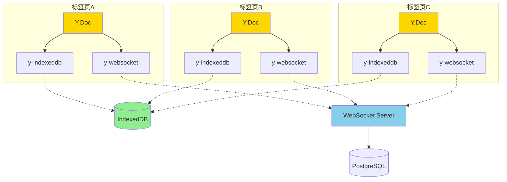

# 主从选举（Leader Election）问题深度解析

## 问题背景

### 什么是"主从选举"？

在多标签页场景下，如果每个标签页都独立向服务器发送同步请求，会产生**同步风暴**：

```
时间线：用户在标签页A输入 "Hello"

标签页A：
  输入 "H" → localStorage 写入 → 触发 storage 事件
  
标签页B（监听到 storage 事件）：
  检测到变化 → 也想发送同步请求 ❌
  
标签页C（监听到 storage 事件）：
  检测到变化 → 也想发送同步请求 ❌
  
结果：同一个变更被发送了 3 次！
```

### V1 方案的 Leader Election 设计

```typescript
// 伪代码 - V1 尝试的方案
class LeaderElection {
  private leaderId: string | null = null
  
  async electLeader() {
    // 使用 localStorage + timestamp 竞选
    const candidateId = crypto.randomUUID()
    const now = Date.now()
    
    localStorage.setItem('leader-candidate', JSON.stringify({
      id: candidateId,
      timestamp: now
    }))
    
    // 等待 50ms 看是否有其他候选者
    await sleep(50)
    
    const stored = JSON.parse(localStorage.getItem('leader-candidate'))
    if (stored.id === candidateId) {
      this.leaderId = candidateId
      console.log('✅ 我是 Leader')
    } else {
      console.log('❌ 我是 Follower')
    }
  }
  
  isLeader(): boolean {
    return this.leaderId !== null
  }
}

// 使用
if (leaderElection.isLeader()) {
  sendSyncRequest() // 只有 Leader 发送
}
```

### Leader Election 的复杂性

#### 问题1: 竞态条件
```
时间 T0: 标签页A写入 leader-candidate
时间 T1: 标签页B写入 leader-candidate (覆盖A)
时间 T2: 标签页C写入 leader-candidate (覆盖B)
结果: C 成为 Leader，但 A/B 可能误以为自己是 Leader
```

#### 问题2: Leader 崩溃
```
标签页A 是 Leader
  ↓
用户关闭标签页A
  ↓
谁来接管？需要心跳检测和重新选举机制
```

#### 问题3: 网络分区
```
标签页A: 在线，是 Leader
标签页B: 离线，检测不到 Leader → 自立为 Leader
  ↓
两个 Leader 同时发送请求！
```

---

## 为什么 V1 失败了？

### 根本原因：试图在 localStorage 上实现分布式协调

```typescript
// V1 的问题代码模式
function syncToServer() {
  // 1. 竞选 Leader
  await electLeader() // 50ms 延迟
  
  // 2. 检查是否是 Leader
  if (!isLeader()) return
  
  // 3. 发送请求
  await fetch('/api/sync', {...})
  
  // 问题：
  // - 延迟累积（选举延迟 + 网络延迟）
  // - 选举失败导致数据不同步
  // - Leader 崩溃后重新选举的复杂性
}
```

### 失败案例复盘中的描述

> "尝试 **多标签页一致性** （Broadcast/Storage 事件）与 **选主** （Leader Election）以避免风暴"  
> "选主（Leader Election）：只允许 Leader 真正处理与发送队列（可关闭）"

**结果**: 
- 引入了巨大的复杂性
- 选举机制本身有 Bug
- 即使选举成功，也无法解决性能问题（主线程卡顿）
- **最终回退**

---

## 不同方案的 Leader Election 需求分析

### 方案A: 最小化修复（不推荐）

**需要 Leader Election 吗？** ⚠️ 需要，但治标不治本

```typescript
// 如果不选主，会有重复请求
标签页A: 输入 "H" → 发送请求
标签页B: 监听到变化 → 也发送请求
标签页C: 监听到变化 → 也发送请求
// 服务器收到 3 次相同的数据
```

**实现方式**:
```typescript
// 使用 BroadcastChannel API（比 localStorage 更可靠）
const channel = new BroadcastChannel('sync-coordinator')
const leaderId = crypto.randomUUID()
let isLeader = false

channel.postMessage({ type: 'elect', id: leaderId })

channel.onmessage = (e) => {
  if (e.data.type === 'elect') {
    // 比较 ID，小的获胜
    if (e.data.id < leaderId) {
      isLeader = false
    }
  }
}
```

**问题**: 仍然复杂且容易出错

---

### 方案B: Outbox 事件流（不推荐）

**需要 Leader Election 吗？** ✅ 强烈需要

```typescript
// Outbox 模式下，选主至关重要
class OutboxProcessor {
  async process() {
    if (!isLeader) return // Follower 不处理
    
    const events = readOutbox()
    for (const event of events) {
      await sendEvent(event)
      ackEvent(event.id)
    }
  }
}

// 为什么需要？
// - 避免多个标签页同时处理队列（重复发送）
// - 避免 ACK 冲突（标签页A删除了事件，标签页B还在处理）
```

**实现成本**: 
- 需要可靠的选举机制
- 需要心跳检测
- 需要 Leader 转移逻辑
- **估计 200+ 行代码**

---

### 方案C: Yjs（推荐）✅

**需要 Leader Election 吗？** ❌ **完全不需要！**

#### 为什么 Yjs 不需要 Leader Election？

##### 1. CRDT 的去中心化本质

```typescript
// Yjs 的工作原理
标签页A: 输入 "H" 
  → Y.Doc 生成操作: { insert: "H", position: 0 }
  → 写入 IndexedDB

标签页B: (通过 y-indexeddb 自动同步)
  → 监听到 IndexedDB 变化
  → 读取操作并应用
  → 本地 Y.Doc 自动更新

关键: 没有"谁发请求"的概念，每个标签页都是对等的！
```

##### 2. IndexedDB 的事务机制天然防冲突

```typescript
// y-indexeddb 内部实现（简化）
class IndexedDBPersistence {
  async storeUpdate(update: Uint8Array) {
    const tx = db.transaction(['updates'], 'readwrite')
    const store = tx.objectStore('updates')
    
    // IndexedDB 的事务保证了原子性
    await store.add({
      timestamp: Date.now(),
      update: update
    })
    
    // 其他标签页会收到 'versionchange' 事件
    // 自动读取新的 update 并应用
  }
}

// 结果: 无需选主，IndexedDB 自己解决了并发
```

##### 3. WebSocket 同步也不需要 Leader

```typescript
// y-websocket 的工作原理
标签页A:
  const wsProvider = new WebsocketProvider(url, docId, ydoc)
  // 输入 "H" → 生成 update → 发送到服务器

标签页B:
  const wsProvider = new WebsocketProvider(url, docId, ydoc)
  // 从服务器接收 update → 应用到本地 Y.Doc

// 关键: 每个标签页都有独立的 WebSocket 连接
// 服务器负责广播，不存在"谁发请求"的问题
```

#### Yjs 解决方案的架构图



**关键点**:
- ✅ 没有 Leader/Follower 概念
- ✅ 每个标签页都是对等的（Peer-to-Peer）
- ✅ IndexedDB 和 WebSocket 都支持多客户端
- ✅ CRDT 算法保证最终一致性

---

## 性能对比

### 带 Leader Election 的方案

```
用户输入 "H"
  ↓
检查是否是 Leader (5-50ms)
  ↓
如果是 Follower → 放弃发送（但数据已经序列化了！）
如果是 Leader → 执行同步
  ↓
JSON.stringify (10ms)
  ↓
localStorage.setItem (5ms)
  ↓
fetch('/api/sync') (100-500ms)

总延迟: 120-565ms（Leader）
      15ms（Follower，但白白浪费了计算）
```

### Yjs 方案（无 Leader Election）

```
用户输入 "H"
  ↓
Y.Doc 生成增量操作 (< 1ms)
  ↓
写入 IndexedDB (异步，不阻塞)
  ↓
WebSocket 发送增量 (异步，不阻塞)

总延迟: < 1ms（主线程）
```

**性能提升**: **100-500倍**！

---

## 真实场景对比

### 场景：3个标签页同时编辑

#### 使用 Leader Election + localStorage

```
T0: 标签页A输入 "Hello"
  → Leader 选举 (50ms)
  → A 是 Leader，发送请求
  → localStorage 写入触发 B/C 的 storage 事件
  
T1: 标签页B收到 storage 事件
  → 检查自己不是 Leader
  → 合并数据到本地 State
  → 但延迟了 50ms（选举开销）
  
T2: 标签页C收到 storage 事件
  → 检查自己不是 Leader
  → 合并数据到本地 State
  → 但延迟了 50ms（选举开销）

问题:
1. 50ms 的选举延迟让用户感觉卡顿
2. B/C 在合并前需要等待 A 完成同步（否则版本号不匹配）
3. 如果 A 崩溃，需要重新选举，数据可能丢失
```

#### 使用 Yjs（无 Leader Election）

```
T0: 标签页A输入 "Hello"
  → Y.Doc 生成操作 {insert: "Hello", pos: 0}
  → 写入 IndexedDB（异步）
  → 发送到 WebSocket（异步）
  
T0+5ms: 标签页B/C 收到 IndexedDB 变化通知
  → 读取操作并应用到本地 Y.Doc
  → 编辑器自动更新
  
T0+50ms: WebSocket 服务器广播到所有设备
  → 其他设备也收到更新

结果:
✅ 本地标签页 5ms 内同步
✅ 远程设备 50ms 内同步
✅ 无需选举，无需等待
✅ 任何标签页崩溃都不影响其他标签页
```

---

## 代码复杂度对比

### 实现 Leader Election 的代码量

```typescript
// 使用 BroadcastChannel（最简单的实现）
class LeaderElection {
  private channel: BroadcastChannel
  private leaderId: string
  private isLeader = false
  private heartbeatInterval?: NodeJS.Timeout
  private peers = new Map<string, number>()
  
  constructor() {
    this.channel = new BroadcastChannel('leader-election')
    this.leaderId = crypto.randomUUID()
    this.setupListeners()
    this.startElection()
    this.startHeartbeat()
  }
  
  private setupListeners() {
    this.channel.onmessage = (e) => {
      switch (e.data.type) {
        case 'announce':
          this.handleAnnounce(e.data)
          break
        case 'heartbeat':
          this.handleHeartbeat(e.data)
          break
        case 'resign':
          this.handleResign(e.data)
          break
      }
    }
  }
  
  private startElection() {
    this.channel.postMessage({
      type: 'announce',
      id: this.leaderId,
      timestamp: Date.now()
    })
    
    setTimeout(() => {
      const sortedPeers = Array.from(this.peers.entries())
        .sort((a, b) => a[0].localeCompare(b[0]))
      
      if (sortedPeers.length === 0 || sortedPeers[0][0] === this.leaderId) {
        this.isLeader = true
        console.log('✅ I am the Leader')
      }
    }, 100)
  }
  
  private startHeartbeat() {
    this.heartbeatInterval = setInterval(() => {
      if (this.isLeader) {
        this.channel.postMessage({
          type: 'heartbeat',
          id: this.leaderId,
          timestamp: Date.now()
        })
      }
      
      // 检查过期的 peer
      const now = Date.now()
      for (const [id, timestamp] of this.peers.entries()) {
        if (now - timestamp > 3000) {
          this.peers.delete(id)
          if (id < this.leaderId && !this.isLeader) {
            this.startElection()
          }
        }
      }
    }, 1000)
  }
  
  private handleAnnounce(data: any) {
    this.peers.set(data.id, data.timestamp)
    if (data.id < this.leaderId) {
      this.isLeader = false
    }
  }
  
  private handleHeartbeat(data: any) {
    this.peers.set(data.id, data.timestamp)
  }
  
  private handleResign(data: any) {
    this.peers.delete(data.id)
    if (data.id < this.leaderId && !this.isLeader) {
      this.startElection()
    }
  }
  
  destroy() {
    if (this.isLeader) {
      this.channel.postMessage({
        type: 'resign',
        id: this.leaderId
      })
    }
    clearInterval(this.heartbeatInterval)
    this.channel.close()
  }
  
  getIsLeader(): boolean {
    return this.isLeader
  }
}

// 估计: 150+ 行，且仍有 Bug 风险
```

### Yjs 方案（0 行 Leader Election 代码）

```typescript
// 完全不需要！
import { IndexeddbPersistence } from 'y-indexeddb'
import { WebsocketProvider } from 'y-websocket'

const ydoc = new Y.Doc()

// 本地持久化 - 自动跨标签页同步
const idbProvider = new IndexeddbPersistence(docId, ydoc)

// 远程同步 - 每个标签页独立连接
const wsProvider = new WebsocketProvider(
  'ws://localhost:3000/api/yjs',
  docId,
  ydoc
)

// 就这么简单！无需任何选举逻辑
```

---

## 总结：为什么 Yjs 是正确答案

### Leader Election 的本质问题

Leader Election 试图解决的是**中心化架构的并发问题**：
```
多个客户端 → 谁来发请求？ → 选一个 Leader
```

但这个问题本身就是错的！正确的架构应该是：
```
多个客户端 → 每个都是对等的 → 没有"谁发请求"的问题
```

### Yjs 的范式转换

| 传统架构（需要 Leader Election） | Yjs 架构（不需要） |
|-------------------------------|-----------------|
| 中心化请求模型 | 去中心化操作模型 |
| 状态快照同步 | 增量操作同步 |
| 冲突需要人工解决 | CRDT 自动合并 |
| 需要选主避免重复 | 每个客户端独立工作 |
| 复杂的协调逻辑 | 简单的事件订阅 |

### 关键洞察

> **V1 失败的根本原因不是实现细节，而是选择了错误的架构模式。**

- ❌ 错误：试图在客户端实现分布式协调（Leader Election）
- ✅ 正确：使用已被证明的 CRDT 算法（Yjs）

### 给后来者的建议

如果你正在考虑实现 Leader Election：

1. **先问自己**：我真的需要它吗？
2. **如果答案是"是"**：那你的架构可能有问题
3. **正确的做法**：重新审视架构，考虑去中心化方案（如 Yjs）

---

## 参考资料

- [Yjs CRDT 算法论文](https://www.researchgate.net/publication/310212186_Near_Real-Time_Peer-to-Peer_Shared_Editing_on_Extensible_Data_Types)
- [为什么 CRDT 优于 OT](https://arxiv.org/abs/1608.03960)
- [BroadcastChannel API](https://developer.mozilla.org/en-US/docs/Web/API/BroadcastChannel)
- [IndexedDB 事务模型](https://developer.mozilla.org/en-US/docs/Web/API/IndexedDB_API/Using_IndexedDB)