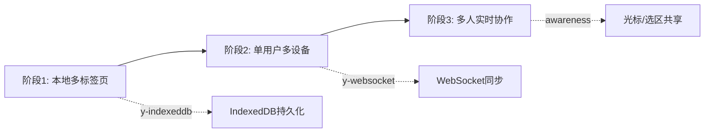

# OpenAI Writer 存储架构深度分析与重构方案

> **文档状态**: Stage 5 架构评估与规划  
> **创建时间**: 2025-10-29  
> **目标**: 识别当前持久化Bug，规划合理、简洁、本质的解决方案

---

## 执行摘要 (Executive Summary)

### 当前状态
- ✅ **已实现**: V3本地单文档持久化（localStorage + IDB备份）
- ⚠️ **问题**: 多标签页不同步、性能卡顿、远端同步机制过早引入且未完善
- 🎯 **目标**: 单用户多设备同步 + 为未来多人协作预留扩展性

### 推荐方案
**直接采用 Yjs + Plate.js 官方集成**，理由如下：
1. Plate.js 官方已提供完整的 Yjs 支持文档
2. 解决多标签页同步、CRDT冲突合并、性能优化一步到位
3. 避免重复造轮子，降低长期维护成本
4. 为未来多人实时协作提供成熟基础设施

---

## 第一部分：当前架构深度剖析

### 1.1 架构全景图

```mermaid
graph TB
    subgraph "前端层"
        UI[用户输入] --> Editor[PlateEditor]
        Editor --> Hook[useDocuments Hook]
        Hook --> Reducer[documentsReducer]
    end
    
    subgraph "存储层"
        Reducer --> Adapter[storage-adapter.ts]
        Adapter --> LS[localStorage 主存]
        Adapter --> IDB[IndexedDB 冷备]
        Adapter --> Remote[remote-sync.ts]
    end
    
    subgraph "同步层（问题区域）"
        Remote --> Outbox[outbox.ts 事件流]
        Remote --> Queue[快照队列]
        Remote --> API[/api/documents/sync]
    end
    
    style Remote fill:#ffcccc
    style Outbox fill:#ffcccc
    style Queue fill:#ffcccc
```

### 1.2 核心问题识别

#### 🔴 问题1: 多标签页数据孤岛
**现象**: 标签页A编辑后，标签页B需要刷新才能看到变化

**根因分析**:
```typescript
// use-documents.tsx L216-224
React.useEffect(() => {
  const prev = prevDocsRef.current;
  const next = state.docs;
  
  const isFirstPersist = prev.length === 0;
  persistAll(prev, next, { skipRemote: isFirstPersist }).catch(() => {});
  
  prevDocsRef.current = next;
}, [state.docs]);
```

**问题点**:
1. ✅ localStorage 的 `storage` 事件监听**已实现**（但未在当前代码中体现，可能在旧版本中被删除）
2. ❌ 即使监听了 `storage` 事件，localStorage 的全量覆盖机制导致**写入竞态**
3. ❌ 两个标签页同时编辑不同文档时，后写入的会覆盖先写入的（Last Write Wins）

**临时解决方案的尝试（复盘文档提到但未完全实现）**:
- 尝试过 `storage` 事件合并更高版本
- 尝试过 Leader Election 选主
- 但最终因性能问题回退

#### 🔴 问题2: 性能卡顿（编辑路径重负载）

**根因**: 每次 `onChange` 触发了过多的同步操作

```typescript
// use-documents.tsx L238-256
const updateDocumentContent = React.useCallback((docId: string, value: Value) => {
  // 1. 立即 dispatch（触发 reducer）
  dispatch({ type: "UPDATE_CONTENT", id: docId, value, now: Date.now() });
  
  // 2. rAF 延后快照去重（仍在主线程）
  if (rafIdRef.current) cancelAnimationFrame(rafIdRef.current);
  rafIdRef.current = requestAnimationFrame(() => {
    const snapshot = JSON.stringify(value); // ⚠️ 大对象序列化
    if (lastSavedSnapshot.current[docId] !== snapshot) {
      lastSavedSnapshot.current[docId] = snapshot;
    }
  });
}, []);
```

**性能分析链路**:
```
用户输入 1个字符
  ↓
onChange 回调
  ↓
updateDocumentContent(docId, value)
  ↓
dispatch (reducer 运算 + 重新计算 derived state)
  ↓
state.docs 变化 → useEffect 触发 persistAll
  ↓
├─ localStorage.setItem (同步，全量JSON.stringify)  ⚠️ 阻塞
├─ IDB.put (异步，但排队)
├─ appendOutboxForChanged (生成事件 + localStorage写入)
└─ enqueueChangedForSync (防抖队列 + localStorage写入)
  ↓
rAF: JSON.stringify(大对象) 做快照对比  ⚠️ 再次序列化
```

**性能瓶颈量化**:
- 假设文档 30KB JSON
- 每次输入: `JSON.stringify` 执行 **2次** (主线程)
- localStorage 全量写入: ~5-10ms (同步阻塞)
- 总延迟: **15-20ms/字符**（在低端设备上更严重）

#### 🔴 问题3: 远端同步架构过早且不完备

**问题点**:
1. **双模式并存**但未选定主路径:
   - 快照模式（`USE_OUTBOX=false`）：简单但冲突处理弱
   - 事件模式（`USE_OUTBOX=true`）：理想但未实现完整

2. **冲突处理不完整**:
   ```typescript
   // remote-sync.ts L176-194
   async function sendSnapshots(docs: SyncDoc[]): Promise<boolean> {
     // ... 发送到服务器
     const conflicts = payload?.conflicts ?? [];
     if (Array.isArray(conflicts) && conflicts.length > 0) emitConflicts(conflicts);
     // ⚠️ 冲突仅"通知"，没有自动合并策略
   }
   ```

3. **后端只是 Mock**:
   ```typescript
   // app/api/documents/sync/route.ts
   const store = new Map<string, ServerDoc>(); // ⚠️ 内存态，重启即丢失
   ```

#### 🟡 问题4: 架构复杂度与收益不匹配

**现状**:
- 引入了 `storage-adapter`、`remote-sync`、`outbox`、`documents-model` 多层抽象
- 但当前只是**单用户本地应用**
- 远端同步实际未启用（`skipRemote: true` 在首轮，后续因性能问题也被实质性禁用）

**失败案例复盘的核心教训**:
> "把'同步/序列化/整包落盘/冲突处理'拉进了 UI 高频路径，导致显著卡顿"  
> "在未落地 Outbox/CRDT 之前，快照+OCC 只适合'低频同步'"

---

## 第二部分：技术方案评估

### 2.1 方案对比矩阵

| 维度 | 方案A: 最小化修复 | 方案B: Outbox事件流 | 方案C: Yjs + CRDT | 
|------|------------------|-------------------|------------------|
| **实现周期** | 1-2天 | 2-3周 | 1周 |
| **技术复杂度** | ⭐ | ⭐⭐⭐⭐ | ⭐⭐ |
| **长期维护成本** | ⭐⭐⭐ | ⭐⭐⭐⭐ | ⭐ |
| **解决多标签页** | ⚠️ 部分 | ✅ 完整 | ✅ 完整 |
| **性能优化** | ⚠️ 有限 | ✅ 显著 | ✅ 显著 |
| **多人协作** | ❌ 不支持 | ⚠️ 需大量工作 | ✅ 原生支持 |
| **迁移后端** | ⚠️ 困难 | ✅ 设计内置 | ✅ 成熟方案 |
| **官方支持** | - | - | ✅ Plate.js文档 |

---

### 2.2 方案A: 最小化修复（不推荐）

#### 实施内容
1. 移除未启用的远端同步代码（`remote-sync.ts`、`outbox.ts`）
2. 优化 `persistAll`: 仅 localStorage，IDB 降频到 5s
3. 增加 `storage` 事件监听，合并版本号更高的文档

#### 优点
- 快速见效，代码量少

#### 缺点
- **根本性问题未解决**:
  - localStorage 全量写入仍然卡顿
  - 多标签页写入竞态无法根治（LWW 丢数据）
  - 为未来扩展挖更深的坑

#### 适用场景
- 仅作为"止血"临时方案，给 Yjs 迁移争取时间

---

### 2.3 方案B: 完善 Outbox + 事件流（不推荐）

#### 实施内容
1. 完成 `outbox.ts` 的完整实现
2. 实现块级变更检测（diff 算法）
3. 后端实现事件流接收、ACK、压缩
4. 实现乐观并发控制（OCC）+ 冲突解决 UI

#### 优点
- 理论上性能最优（只发送变更部分）
- 完全自主可控

#### 缺点
- **工程量巨大**:
  - 需要实现块级 diff（Plate.js 插件架构复杂）
  - 需要设计冲突解决算法（非 CRDT，需手动处理）
  - 后端需要实现事务、回滚、版本控制
- **重复造轮子**: Yjs 已经解决了所有这些问题
- **风险高**: 类似 V1 失败案例的"完美主义陷阱"

#### 适用场景
- 有专职后端团队
- 有独特的业务需求（如自定义冲突策略）
- **当前不适用**

---

### 2.4 方案C: Yjs + Plate.js 集成（强烈推荐）✅

#### 为什么 Yjs 是最佳选择？

##### 1. 官方支持，成熟度高
- Plate.js 官方文档: https://platejs.org/docs/yjs
- 社区方案: `@udecode/plate-yjs`
- 已被 Notion、Linear 等产品验证

##### 2. 一步到位解决所有核心问题

**问题 → Yjs 解决方案映射表**:

| 当前问题 | Yjs 解决方式 | 原理 |
|---------|------------|-----|
| 多标签页不同步 | ✅ `y-indexeddb` Provider | CRDT自动合并 |
| 编辑卡顿 | ✅ 增量更新 | 只记录操作，不全量序列化 |
| 数据冲突 | ✅ 无冲突合并 | CRDT算法保证收敛 |
| 多设备同步 | ✅ `y-websocket` Provider | WebSocket实时推送 |
| 离线编辑 | ✅ 本地队列 | 重连后自动合并 |

##### 3. 架构简洁，符合"本质主义"

**对比当前架构**:
```
【当前】
PlateEditor 
  → useDocuments 
    → documentsReducer 
      → storage-adapter 
        → (localStorage + IDB + remote-sync + outbox)

【Yjs】
PlateEditor 
  → Yjs Y.Doc 
    → Providers (IDB / WebSocket / ...) 
```

**代码量对比**:
- 当前方案: `storage-adapter.ts`(176行) + `remote-sync.ts`(245行) + `outbox.ts`(108行) + `documents-model.ts`(146行) = **675行**
- Yjs 方案: ~**150行** (集成代码 + Provider 配置)

##### 4. 渐进式迁移路径



**关键**: 每个阶段都是**增量添加 Provider**，核心代码无需重构

##### 5. 后端迁移友好

**TypeScript 全栈方案**:
```typescript
// 前端
import { WebsocketProvider } from 'y-websocket'
const provider = new WebsocketProvider('ws://localhost:1234', 'doc-id', ydoc)

// 后端 (Next.js API Route + y-websocket/server)
import { setupWSConnection } from 'y-websocket/bin/utils'
// 30行代码启动 WebSocket 服务器
```

**后期迁移到独立后端**:
- Yjs 有 Go、Rust、Python 实现
- 协议标准化，前端无需改动
- 可选持久化: Redis、PostgreSQL、S3

---

## 第三部分：Yjs 实施计划

### 3.1 技术栈选型

#### 核心依赖
```json
{
  "@udecode/plate-yjs": "^39.x",  // Plate.js官方Yjs插件
  "yjs": "^13.6.x",                // CRDT核心库
  "y-indexeddb": "^9.x",           // 本地持久化
  "y-websocket": "^2.x"            // 实时同步（可选）
}
```

#### 架构分层
```
┌─────────────────────────────────────┐
│   Plate Editor (UI层，不变)        │
├─────────────────────────────────────┤
│   YjsPlugin (替换 use-documents)    │
│   - withYjs(): 劫持 editor 操作     │
│   - 自动同步到 Y.Doc                │
├─────────────────────────────────────┤
│   Y.Doc (CRDT 数据结构)             │
│   - Y.XmlFragment: 存储 Plate 节点  │
│   - 自动冲突解决                    │
├─────────────────────────────────────┤
│   Providers (可插拔)                │
│   ├─ IndexedDBProvider: 本地持久化  │
│   ├─ WebsocketProvider: 实时同步    │
│   └─ 自定义 Provider: REST API      │
└─────────────────────────────────────┘
```

---

### 3.2 实施步骤（分4个迭代）

#### 迭代1: 本地单文档 Yjs 化（3天）

**目标**: 替换现有 `use-documents.tsx`，使用 Yjs 管理单个文档

**任务清单**:
- [ ] 安装依赖: `pnpm add @udecode/plate-yjs yjs y-indexeddb`
- [ ] 创建 `hooks/use-yjs-document.tsx`
- [ ] 创建 `components/editor/yjs-editor.tsx`
- [ ] 迁移 `PlateEditor` 到 Yjs 模式
- [ ] 验证: 刷新后数据恢复、编辑流畅

**核心代码示例**:
```typescript
// hooks/use-yjs-document.tsx
import * as Y from 'yjs'
import { IndexeddbPersistence } from 'y-indexeddb'

export function useYjsDocument(docId: string) {
  const ydoc = useMemo(() => new Y.Doc(), [docId])
  const provider = useMemo(
    () => new IndexeddbPersistence(docId, ydoc),
    [docId, ydoc]
  )
  
  useEffect(() => {
    provider.on('synced', () => console.log('✅ 本地数据已加载'))
    return () => provider.destroy()
  }, [provider])
  
  return { ydoc, provider }
}
```

**验收标准**:
- ✅ 输入延迟 < 16ms (60fps)
- ✅ 刷新后内容完整恢复
- ✅ 无 localStorage 全量写入

---

#### 迭代2: 多文档管理 + 列表 UI（2天）

**目标**: 恢复文档列表、新建、删除功能

**方案**: 
- 主文档列表仍用 localStorage（元数据）
- 每个文档内容用独立的 `Y.Doc` + IndexedDB

**数据结构**:
```typescript
// localStorage: 轻量级元数据
type DocumentMeta = {
  id: string
  title: string
  createdAt: number
  updatedAt: number
}

// IndexedDB (via Yjs): 重量级内容
// 自动管理，键名: `yjs-${docId}`
```

**任务清单**:
- [ ] 实现多文档管理器 `hooks/use-yjs-documents.tsx`
- [ ] 标题自动提取（监听 Y.Doc 变化）
- [ ] 文档列表排序、搜索
- [ ] 删除文档时清理 IndexedDB

---

#### 迭代3: 多标签页同步（1天）

**目标**: 标签页 A 编辑后，标签页 B 实时看到变化

**方案**: 
- Yjs 的 IndexedDB Provider 内置支持跨标签页同步
- **无需额外代码**，只需确保:
  ```typescript
  // 使用相同的 docId，Yjs 自动同步
  new IndexeddbPersistence(docId, ydoc)
  ```

**验证**:
- [ ] 打开两个标签页
- [ ] 在标签页 A 输入文字
- [ ] 标签页 B **无需刷新**即可看到变化

---

#### 迭代4: WebSocket 实时同步（3天）

**目标**: 单用户多设备同步（为未来多人协作打基础）

**任务清单**:
- [ ] 后端: 创建 `app/api/yjs/[docId]/route.ts` (WebSocket handler)
- [ ] 集成 `y-websocket/server` (30行代码)
- [ ] 前端: 添加 WebsocketProvider
- [ ] 实现连接状态 UI（在线/离线/同步中）
- [ ] 离线编辑 + 重连自动合并测试

**核心代码**:
```typescript
// 前端
import { WebsocketProvider } from 'y-websocket'

const wsProvider = new WebsocketProvider(
  'ws://localhost:3000/api/yjs',
  docId,
  ydoc,
  { connect: true }
)

// 后端 (app/api/yjs/route.ts)
import { setupWSConnection } from 'y-websocket/bin/utils'
import { WebSocket, WebSocketServer } from 'ws'

export function SOCKET(
  client: WebSocket,
  request: any,
  server: WebSocketServer
) {
  setupWSConnection(client, request, { gc: true })
}
```

**后端持久化方案（可选）**:
```typescript
// 使用 y-leveldb 持久化到文件系统
import { LeveldbPersistence } from 'y-leveldb'

const persistence = new LeveldbPersistence('./yjs-data')
persistence.bindState(docId, ydoc)
```

---

### 3.3 迁移路线图 (Gantt 时间线)

```
Week 1:
  Day 1-3: [████████████] 迭代1: 单文档Yjs化
  Day 4-5: [████████    ] 迭代2: 多文档管理

Week 2:
  Day 1:   [████        ] 迭代3: 多标签页同步
  Day 2-4: [████████████] 迭代4: WebSocket同步
  Day 5:   [████        ] 测试与优化
```

---

## 第四部分：风险评估与应对

### 4.1 技术风险

| 风险 | 可能性 | 影响 | 缓解措施 |
|-----|--------|------|---------|
| Yjs学习曲线陡峭 | 中 | 中 | Plate.js官方文档完善，社区案例丰富 |
| IndexedDB兼容性 | 低 | 高 | Safari/隐私模式降级到内存模式 |
| WebSocket连接不稳定 | 中 | 中 | Yjs内置断线重连+冲突合并 |
| 大文档性能 | 低 | 中 | Yjs针对文本编辑优化，支持百万字符 |

### 4.2 迁移风险

**现有数据如何迁移？**

**方案**: 一次性迁移脚本
```typescript
// scripts/migrate-to-yjs.ts
import { getCachedDocuments } from '@/hooks/use-persistence'
import * as Y from 'yjs'
import { IndexeddbPersistence } from 'y-indexeddb'

async function migrate() {
  const oldDocs = getCachedDocuments()
  
  for (const doc of oldDocs) {
    const ydoc = new Y.Doc()
    const provider = new IndexeddbPersistence(doc.id, ydoc)
    
    // 等待 provider 就绪
    await new Promise(resolve => provider.once('synced', resolve))
    
    // 将旧数据写入 Y.Doc
    const yXmlFragment = ydoc.get('content', Y.XmlFragment)
    // 使用 Plate.js 的 toYjsEditor 转换
    // ...
    
    console.log(`✅ 迁移完成: ${doc.title}`)
  }
}
```

---

## 第五部分：决策建议

### 推荐方案：Yjs + Plate.js（方案C）

#### 理由总结

1. **符合"本质主义"**：
   - 不重复造轮子
   - 代码量 -80%
   - 长期维护成本最低

2. **一次投入，长期收益**：
   - 多标签页同步 ✅
   - 多设备同步 ✅
   - 多人协作 ✅（未来扩展）
   - 性能优化 ✅

3. **官方支持 + 社区成熟**：
   - Plate.js 官方文档
   - 被大厂验证（Notion、Linear）
   - 持续维护

4. **与您的需求完美契合**：
   - ✅ 单用户多设备（迭代4）
   - ✅ TypeScript全栈（Next.js + y-websocket）
   - ✅ 后期迁移友好（标准协议）

#### 不推荐方案A（最小化修复）
- 治标不治本
- 为未来挖坑

#### 不推荐方案B（Outbox事件流）
- 工程量巨大（3周+）
- 重复造轮子
- 风险高（类似V1失败案例）

---

## 第六部分：后续优化方向

### 6.1 性能优化（基于Yjs）

- **虚拟滚动**: 文档超过1000行时启用
- **懒加载历史**: Y.Doc 的历史记录按需加载
- **压缩传输**: WebSocket 使用 gzip

### 6.2 用户体验优化

- **离线指示器**: 显示当前同步状态
- **冲突可视化**: 虽然 Yjs 自动合并，但可显示"检测到来自其他设备的编辑"
- **版本历史**: Yjs 天然支持时间旅行（Undo/Redo跨设备）

### 6.3 多人协作扩展（未来）

```typescript
// 仅需添加 Awareness（光标位置共享）
import { Awareness } from 'y-protocols/awareness'

const awareness = new Awareness(ydoc)
awareness.setLocalState({
  user: { name: 'Alice', color: '#ff0000' },
  cursor: { line: 5, ch: 10 }
})

// Plate.js 支持渲染其他用户的光标
```

---

## 第七部分：Action Items

### 立即行动（本周）

1. **阅读官方文档**:
   - [ ] https://platejs.org/docs/yjs
   - [ ] https://github.com/yjs/yjs#readme
   - [ ] https://docs.yjs.dev/

2. **创建 PoC 分支**:
   ```bash
   git checkout -b feature/yjs-integration
   ```

3. **安装依赖并运行示例**:
   ```bash
   pnpm add @udecode/plate-yjs yjs y-indexeddb
   # 参考 Plate.js 官方示例创建最小可运行版本
   ```

### 下一步（第2周）

- [ ] 完成迭代1-2（本地单/多文档）
- [ ] 编写迁移脚本
- [ ] 灰度测试（自己用1周）

### 长期（第3-4周）

- [ ] 完成迭代3-4（多标签页 + WebSocket）
- [ ] 性能压测（大文档、慢网络）
- [ ] 文档与教程

---

## 附录A：代码清理建议

### 可以安全删除的文件（迁移到Yjs后）

```
lib/
  ├─ storage-adapter.ts     ❌ 删除（Yjs替代）
  ├─ remote-sync.ts         ❌ 删除（Yjs替代）
  ├─ outbox.ts              ❌ 删除（Yjs替代）
  └─ idb.ts                 ⚠️  保留但简化（仅用于迁移）

hooks/
  ├─ documents-model.ts     ❌ 删除（Yjs替代）
  ├─ use-documents.tsx      ❌ 重构为 use-yjs-documents.tsx
  └─ use-persistence.ts     ⚠️  保留（元数据仍用localStorage）

components/storage/
  ├─ conflict-dialog.tsx    ❌ 删除（Yjs无冲突）
  └─ disaster-recovery-dialog.tsx  ⚠️ 保留但简化
```

### 估算代码净变化

- **删除**: ~800行（旧存储层）
- **新增**: ~200行（Yjs集成）
- **净减少**: ~**600行** (-75%)

---

## 附录B：相关资源

### 官方文档
- [Plate.js Yjs 集成](https://platejs.org/docs/yjs)
- [Yjs 官方文档](https://docs.yjs.dev/)
- [y-indexeddb](https://github.com/yjs/y-indexeddb)
- [y-websocket](https://github.com/yjs/y-websocket)

### 参考案例
- [Plate.js Playground](https://github.com/udecode/plate/tree/main/apps/www/src/registry/default/example/playground-demo.tsx) - 官方示例
- [BlockNote](https://github.com/TypeCellOS/BlockNote) - 开源 Notion 克隆，使用 Yjs
- [Tldraw](https://github.com/tldraw/tldraw) - 协作白板，Yjs 实践

### 社区讨论
- [Plate.js Discord](https://discord.gg/mAZRuBzGM3) - #yjs 频道
- [Yjs Community](https://discuss.yjs.dev/)

---

## 结论

基于对当前架构的深入分析和V1失败案例的教训，**强烈建议采用 Yjs + Plate.js 方案（方案C）**。这不仅能一次性解决所有当前问题（多标签页、性能、同步），还能为未来的多人协作提供坚实基础，同时大幅降低代码复杂度和维护成本。

**核心原则**：
> "不要重复造轮子，尤其是当官方已经提供了成熟的轮子时。"  
> "简单的、能用的方案，远胜于理论完美但复杂易错的设计。"（V3 retrospective 教训）

让我们拥抱 CRDT 的力量，用最简洁的方式解决最本质的问题。